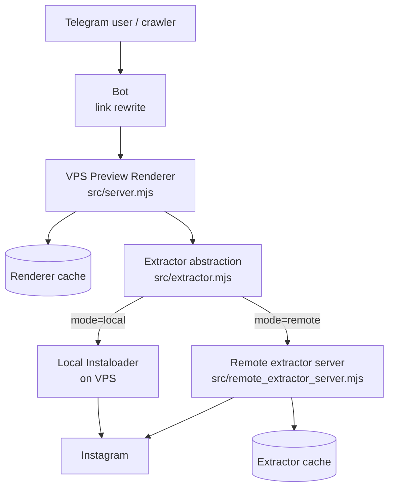
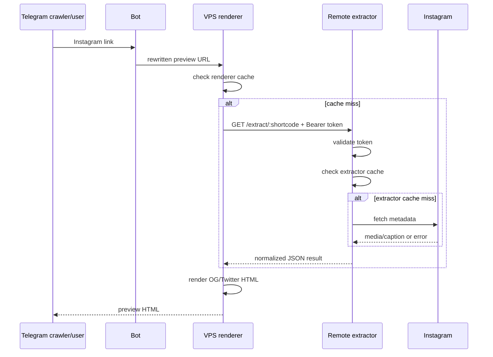
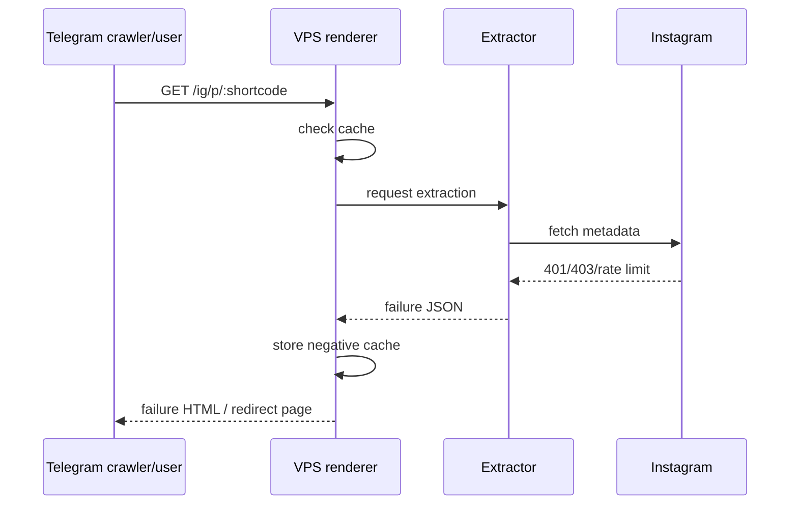
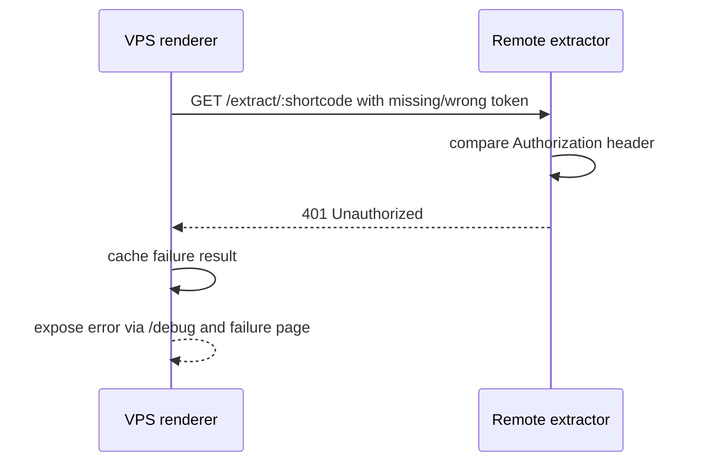

# Instagram Preview Service — Detailed Technical Plan and Status

## Purpose

This document is the canonical technical status report for the Instagram preview work.
It explains in detail:
- what problem existed originally
- what was investigated
- what was proven by testing
- what architecture was chosen and why
- what code and deployment assets were created
- what still does not work
- what remains to be done next

The main goal is to replace fragile Instagram link-fixing behavior with a reliable, debuggable, self-hosted preview pipeline where rendering and extraction are separate concerns.

---

# 1. Original Problem

The old Instagram preview flow relied on brittle assumptions and tools:
- self-hosted InstaFix deployment
- public fixer domains such as `kksave`
- bot-side domain rewriting assumptions
- upstream behavior that looked “up” from the outside but silently failed on real posts

## Symptoms that triggered this work

Observed symptoms included:
- Instagram links not producing proper preview cards in Telegram
- self-hosted InstaFix redirecting back to regular Instagram instead of returning OG/Twitter metadata
- fallback services returning intermediate landing pages rather than real preview metadata
- difficulty distinguishing “service is reachable” from “preview generation actually works”

## Core requirement

The real requirement is not “service returns HTTP 200”.
It is:

> Given an Instagram post or reel URL, return a stable URL whose HTML contains usable Open Graph / Twitter metadata so Telegram and similar platforms can render a preview.

---

# 2. Investigation Summary

## 2.1. Testing the current self-hosted InstaFix deployment

The live self-hosted InstaFix deployment was tested against a real Instagram post URL.

### Result
The service did **not** return a useful preview page with Open Graph metadata.
Instead, it ended up at regular Instagram.

### Why this matters
This proved that the old flow was not merely “slightly degraded”; it was failing at the core purpose of generating preview metadata.

---

## 2.2. Testing public fallback services

Public fallback or fixer-style services were tested for comparison.

### Services checked
- `kksave`
- public fixedgram/instafix-style routes

### Result
These were unreliable for the tested case:
- some returned “Open in App” style pages
- some redirected to Instagram
- some lacked useful `og:*` / `twitter:*` tags for Telegram unfurling

### Why this matters
This showed that public fixer domains should not be trusted as the primary architecture.
They can be degraded, rate-limited, structurally changed, or simply stop exposing useful preview tags.

---

## 2.3. Inspecting upstream InstaFix source code

Upstream source repository inspected:
- `Wikidepia/InstaFix`

Important files previously inspected included:
- `main.go`
- `handlers/embed.go`
- `handlers/oembed.go`
- `handlers/scraper/data.go`
- `views/embed.jade`

### Key findings
Upstream InstaFix only renders preview HTML if extraction succeeds.
If extraction fails or media data cannot be obtained, it redirects back to Instagram.

### Upstream extraction strategy
The upstream code relies on fragile extraction methods such as:
- Instagram `embed/captioned` page scraping
- Instagram GraphQL
- optional remote scraper behavior

### Why this matters
This explained why a deployed InstaFix service can appear healthy while still failing to generate actual previews.
It also confirmed that extraction failure is not always surfaced clearly to the outside.

### Additional architectural clue from upstream
Upstream has a `remote-scraper` concept.
That strongly suggests the original project itself expected extraction from cloud IPs to fail often enough that scraping should be moved elsewhere.

---

## 2.4. Testing a stronger extractor directly: Instaloader

To determine whether the problem was “bad InstaFix code” or “bad extraction environment,” `Instaloader` was installed and tested directly on the VPS.

### Installed on the VPS
- `python3-pip`
- `python3-venv`
- Python virtualenv at `/root/.openclaw/workspace/.venv-instaloader`
- `instaloader`

### Test target
Instagram shortcode:
- `DWU3kwlDyW7`

### Observed responses
Instaloader failed against Instagram GraphQL with errors including:
- `403 Forbidden`
- `401 Unauthorized`
- `Please wait a few minutes before you try again`

### Why this matters
This was the most important validation step.
It proved that even a stronger extraction library is being blocked or throttled from this VPS/cloud IP.

That means the problem is not only “legacy InstaFix implementation quality.”
The extraction environment itself is also a first-class problem.

---

# 3. Main Technical Conclusion

## What the evidence shows

The VPS is good for:
- hosting a stable preview renderer
- exposing health/debug endpoints
- orchestrating calls to extractors
- keeping cache
- serving HTML preview pages

The VPS is **not currently reliable as the primary Instagram extraction environment**.

## Design implication

The long-term architecture should be:
- renderer on VPS
- extractor elsewhere (or at least replaceable)

In short:

- **rendering can stay in the cloud**
- **extraction should not depend entirely on this cloud IP**

---

# 4. Chosen Architecture

## High-level pipeline

Recommended and now partially implemented pipeline:

- **bot** → **preview renderer** → **extractor backend**

## Renderer responsibilities
The renderer should:
- accept Instagram shortcode/URL requests
- call an extractor backend
- render Open Graph / Twitter HTML when extraction succeeds
- expose debug output when extraction fails
- manage cache and fallback behavior

## Extractor responsibilities
The extractor should:
- retrieve Instagram author/caption/media data
- return normalized JSON
- use low request volume
- benefit from caching
- run in an environment Instagram blocks less aggressively

## Bot responsibilities
The bot should:
- rewrite Instagram links to the renderer domain
- remain independent from the extraction internals
- not hardcode assumptions about a single fixer domain forever

## Why this architecture is better
This replaces a brittle monolith-like embed-fix pattern with explicit layers:
- extraction becomes observable
- rendering becomes stable and self-hosted
- extractor backends become swappable
- failure states become debuggable instead of hidden behind redirects

---

# 4.1. Detailed Architecture Scheme

This section describes the system as a full logical and operational scheme.

## 4.1.1. Component diagram

```text
┌───────────────┐
│ Telegram user │
└───────┬───────┘
        │ opens / shares Instagram link rewritten by bot
        ▼
┌───────────────┐
│      Bot      │
│ link rewrite  │
└───────┬───────┘
        │ sends user/platform to preview URL
        ▼
┌───────────────────────────────┐
│ VPS Preview Renderer          │
│ src/server.mjs                │
│                               │
│ routes:                       │
│ - /health                     │
│ - /debug/:shortcode           │
│ - /extract/:shortcode         │
│ - /ig/p/:shortcode            │
│ - /ig/reel/:shortcode         │
└───────┬───────────────────────┘
        │
        │ resolve extraction
        ▼
┌───────────────────────────────┐
│ Extractor abstraction         │
│ src/extractor.mjs             │
│                               │
│ mode=local  -> Instaloader    │
│ mode=remote -> HTTP backend   │
└───────┬───────────────┬───────┘
        │               │
        │               │
        │ local         │ remote
        │               │
        ▼               ▼
┌────────────────┐   ┌────────────────────────────┐
│ Local          │   │ Remote extractor           │
│ Instaloader    │   │ src/remote_extractor_      │
│ on VPS         │   │ server.mjs                 │
└───────┬────────┘   └─────────────┬──────────────┘
        │                          │
        │ Instagram GraphQL/HTML   │ Instagram GraphQL/HTML
        ▼                          ▼
   ┌───────────┐               ┌───────────┐
   │ Instagram │               │ Instagram │
   └───────────┘               └───────────┘
```

---

## 4.1.2. Deployment topology

### Current intended steady state

```text
Public internet / Telegram / crawlers
                │
                ▼
        [ VPS renderer domain ]
                │
                │ private or controlled access
                ▼
   [ home/residential/LTE extractor host ]
                │
                ▼
            Instagram
```

### Why this topology exists
- the renderer benefits from stable hosting, public reachability, and predictable uptime
- the extractor benefits from a better IP reputation/class than the VPS cloud IP
- separating them makes the system resilient to extraction backend changes

---

## 4.1.3. Runtime request flow

### Flow A — happy path with remote extractor

1. User posts or clicks Instagram URL rewritten by the bot.
2. Telegram requests the renderer URL.
3. Renderer receives `/ig/p/:shortcode` or `/ig/reel/:shortcode`.
4. Renderer checks file cache.
5. If there is a fresh cache hit, it uses cached extraction result.
6. If there is no cache hit, renderer calls extractor abstraction.
7. Extractor abstraction sees `EXTRACTOR_MODE=remote`.
8. Renderer sends authenticated HTTP request to `REMOTE_EXTRACTOR_URL/extract/:shortcode`.
9. Remote extractor validates bearer token.
10. Remote extractor checks its own cache.
11. If not cached, remote extractor runs Instaloader (or later another backend).
12. Remote extractor returns normalized JSON.
13. Renderer receives JSON and renders HTML containing OG/Twitter tags.
14. Telegram reads OG/Twitter tags and renders the preview card.
15. Final browser/user navigation ends up redirected to Instagram canonical URL.

### Why this is the ideal flow
It keeps the public-facing preview page stable while letting extraction happen where it is most likely to succeed.

---

### Flow B — renderer cache hit

1. Request reaches renderer.
2. Renderer finds cached extraction result in `.cache`.
3. Renderer skips extractor backend completely.
4. Renderer immediately serves preview HTML or failure HTML based on cached result.

### Why this matters
- reduces repeated calls to Instagram
- reduces rate-limit exposure
- makes retries cheap
- avoids repeatedly hitting a failing extractor for the same shortcode

---

### Flow C — extractor failure path

1. Request reaches renderer.
2. Renderer checks cache and misses.
3. Extractor call fails (local or remote).
4. Failure result is cached with negative-cache TTL.
5. Renderer serves controlled failure HTML rather than pretending success.
6. Debug endpoint exposes exact failure details.

### Why this matters
This prevents silent false positives and creates an honest, inspectable failure mode.

---

## 4.1.4. Data contract between renderer and extractor

### Request

```http
GET /extract/:shortcode
Authorization: Bearer <shared-token>
Accept: application/json
```

### Success response shape

```json
{
  "ok": true,
  "source": "local-instaloader",
  "durationMs": 1234,
  "data": {
    "shortcode": "DWU3kwlDyW7",
    "typename": "GraphVideo",
    "owner_username": "example",
    "caption": "...",
    "is_video": true,
    "mediacount": 1,
    "media": [
      {
        "type": "video",
        "url": "https://...",
        "thumbnail": "https://..."
      }
    ],
    "instagram_url": "https://www.instagram.com/p/DWU3kwlDyW7/"
  },
  "cache": {
    "hit": false,
    "cachedAt": 0,
    "expiresAt": 0,
    "ttlMs": 21600000
  }
}
```

### Failure response shape

```json
{
  "ok": false,
  "source": "local-instaloader",
  "errorCode": "ConnectionException",
  "error": "JSON Query to graphql/query: 401 Unauthorized ...",
  "durationMs": 1234,
  "cache": {
    "hit": false,
    "cachedAt": 0,
    "expiresAt": 0,
    "ttlMs": 1800000
  }
}
```

### Why this matters
The renderer does not need to understand how extraction was achieved.
It only needs a normalized success/failure contract.

---

## 4.1.5. Auth scheme

### Current auth
A shared bearer token is supported via:
- `EXTRACTOR_SHARED_TOKEN`

### Flow
- renderer includes `Authorization: Bearer <token>` when calling remote extractor
- remote extractor compares the header to the configured token
- unauthenticated request gets `401 Unauthorized`

### Why this matters
The extractor should not be an anonymous public endpoint if routed over a reachable network.

---

## 4.1.6. Cache scheme

### Renderer cache
Renderer uses file-based cache for extraction results.

### Remote extractor cache
Remote extractor also uses file-based cache.

### TTLs
- success TTL: 6 hours by default
- failure TTL: 30 minutes by default

### Why double-cache may still be useful
- renderer avoids unnecessary remote calls
- extractor avoids unnecessary Instagram calls
- both layers benefit from short-circuiting repeated work

### Tradeoff
This introduces duplicated cache state, but that is acceptable at the current stage because operational simplicity matters more than cache centralization.

---

## 4.1.7. Failure domains

### Failure domain A — renderer down
Effect:
- preview endpoint unavailable
- no preview HTML served

Mitigation:
- systemd service
- VPS stability
- health endpoint

### Failure domain B — remote extractor down
Effect:
- renderer remote calls fail
- cached content may still work until TTL expiry

Mitigation:
- systemd on extractor host
- debug endpoint
- cache
- possible fallback to local mode for debugging only

### Failure domain C — Instagram blocks extractor
Effect:
- extraction returns 401/403/rate-limit-like failures
- negative cache prevents repeated damage

Mitigation:
- move extractor to better IP class
- optionally add login-backed mode
- keep request rate low

### Failure domain D — auth mismatch
Effect:
- remote extractor returns 401 Unauthorized

Mitigation:
- keep same `EXTRACTOR_SHARED_TOKEN` on both ends
- verify via `/health` and `/debug`

---

## 4.1.8. Future extensibility points

The architecture intentionally leaves room for the following later additions:
- login-backed extractor mode
- alternative extractors besides Instaloader
- managed scraping provider backend
- stronger auth than shared bearer token
- reverse proxy and HTTPS termination
- IP allowlisting
- metrics/logging/audit enhancements
- bot integration via feature flag

### Why this matters
The architecture is designed to survive backend changes rather than be rewritten every time Instagram changes behavior.

---

## 4.1.9. ASCII sequence diagrams

### Sequence A — ideal remote extractor path

```text
Telegram crawler/user      Bot         VPS renderer         Remote extractor         Instagram
       |                   |                |                       |                    |
       | Instagram URL     |                |                       |                    |
       |------------------>|                |                       |                    |
       |                   | rewrite link   |                       |                    |
       |                   |--------------->|                       |                    |
       |                   |                | request /ig/p/:code   |                    |
       |                   |                |---------------------->|                    |
       |                   |                | check renderer cache  |                    |
       |                   |                | (miss)                |                    |
       |                   |                | call /extract/:code   |                    |
       |                   |                |---------------------->|                    |
       |                   |                | Authorization: Bearer |                    |
       |                   |                |                       | validate token     |
       |                   |                |                       | check cache        |
       |                   |                |                       | (miss)             |
       |                   |                |                       | fetch metadata ---->|
       |                   |                |                       |<--------------------|
       |                   |                |<----------------------| normalized JSON     |
       |                   |                | render OG/Twitter HTML|                    |
       |<-----------------------------------| preview HTML          |                    |
       | Telegram unfurls preview           |                       |                    |
```

### Why this sequence matters
This is the target production path.
The public-facing renderer remains stable while extraction happens on the better IP environment.

---

### Sequence B — renderer cache hit

```text
Telegram crawler/user      Bot         VPS renderer         Remote extractor         Instagram
       |                   |                |                       |                    |
       | request preview   |                |                       |                    |
       |----------------------------------->|                       |                    |
       |                   |                | check renderer cache  |                    |
       |                   |                | hit                   |                    |
       |                   |                | render HTML from cache|                    |
       |<-----------------------------------|                       |                    |
       | no extractor call                  |                       |                    |
```

### Why this sequence matters
This is the cheapest and safest steady-state path for repeated requests.
It avoids both extractor load and Instagram load.

---

### Sequence C — remote auth mismatch

```text
Telegram crawler/user      Bot         VPS renderer         Remote extractor
       |                   |                |                       |
       | request preview   |                |                       |
       |----------------------------------->|                       |
       |                   |                | call /extract/:code   |
       |                   |                |---------------------->|
       |                   |                | wrong/missing token   |
       |                   |                |                       | reject request
       |                   |                |<----------------------| 401 Unauthorized
       |                   |                | cache failure result  |
       |                   |                | return failure HTML   |
       |<-----------------------------------|                       |
```

### Why this sequence matters
This isolates a configuration/security failure from an Instagram extraction failure.
It makes auth problems visible and debuggable.

---

### Sequence D — Instagram blocks extractor

```text
Telegram crawler/user      Bot         VPS renderer         Remote extractor         Instagram
       |                   |                |                       |                    |
       | request preview   |                |                       |                    |
       |----------------------------------->|                       |                    |
       |                   |                | cache miss            |                    |
       |                   |                | call /extract/:code   |                    |
       |                   |                |---------------------->|                    |
       |                   |                |                       | cache miss         |
       |                   |                |                       | fetch metadata ---->|
       |                   |                |                       |<--------------------|
       |                   |                |                       | 401/403/rate-limit |
       |                   |                |<----------------------| failure JSON        |
       |                   |                | negative-cache result |                    |
       |                   |                | render failure HTML   |                    |
       |<-----------------------------------|                       |                    |
```

### Why this sequence matters
This reflects the current observed failure mode from the VPS environment and explains why negative cache exists.

---

### Sequence E — local debugging mode on VPS

```text
Operator / developer            VPS renderer              Local Instaloader             Instagram
        |                            |                           |                          |
        | GET /debug/:code           |                           |                          |
        |--------------------------->|                           |                          |
        |                            | check cache / maybe miss  |                          |
        |                            | run local extractor ----->|                          |
        |                            |                           | fetch metadata --------->|
        |                            |                           |<-------------------------|
        |                            |<--------------------------| success or failure JSON  |
        |<---------------------------| detailed debug response   |                          |
```

### Why this sequence matters
This is useful for diagnostics even if local VPS extraction is not suitable for production.

---

## 4.1.10. Mermaid diagrams

### Mermaid architecture graph



### Why this diagram matters
This visualizes the main architectural split: stable renderer in one place, swappable extraction backend in another.

---

### Mermaid sequence — happy path through remote extractor



### Why this diagram matters
This is the intended steady-state operational path.

---

### Mermaid sequence — blocked extraction path



### Why this diagram matters
This reflects the failure mode that was actually observed in testing on the VPS.

---

### Mermaid sequence — auth mismatch path



### Why this diagram matters
It distinguishes configuration/security failure from Instagram extraction failure.

---

## 4.1.11. Component status table

| Component | Main file(s) | Responsibility | Current status | Known limitation | Remaining work |
|---|---|---|---|---|---|
| Preview renderer | `src/server.mjs` | Public-facing preview HTML, health/debug routes, extraction orchestration | Implemented and running locally on VPS | Final value depends on a working extractor backend | Point to real remote extractor and validate end-to-end unfurling |
| Extractor abstraction | `src/extractor.mjs` | Switch between local and remote extraction backends | Implemented | Local backend still fails on VPS IP; remote backend needs real target | Use real remote endpoint in production |
| Local extractor backend | local Instaloader via `.venv-instaloader` | Diagnostic/local extraction on VPS | Installed and callable | Instagram blocks/throttles this VPS environment | Keep mostly for debugging, not as primary production path |
| Cache layer | `src/cache.mjs` | File-based success + negative cache | Implemented and validated | Local file cache only; no centralized invalidation | Tune TTLs if needed after real traffic |
| Remote extractor reference server | `src/remote_extractor_server.mjs` | JSON extraction API for remote mode | Implemented | Needs deployment on better IP environment to become useful | Run on home/residential/LTE host |
| Auth layer | `src/auth.mjs` | Shared bearer-token protection for remote extractor | Implemented and tested | Shared-token auth is minimal, not full zero-trust hardening | Optionally add IP allowlist / reverse proxy / stronger auth |
| Renderer env/config templates | `.env.example`, `deploy/insta-preview-renderer.env.example` | Configure renderer locally or on VPS | Implemented | Still needs real extractor URL and production values | Fill in real endpoint/token |
| Extractor env/config templates | `.env.example`, `deploy/insta-remote-extractor.env.example` | Configure remote extractor on external host | Implemented | Needs actual host-specific paths and secrets | Fill in real Python path/cache dir/token |
| Renderer systemd unit | `deploy/insta-preview-renderer.service` | Run renderer as user service | Implemented | Not yet installed here as final managed service for this project | Install once remote extractor is ready |
| Extractor systemd unit | `deploy/insta-remote-extractor.service` | Run extractor as user service on remote host | Implemented | Useless on VPS as-is because extraction IP is the problem | Install on better IP host |
| Home extractor setup guide | `deploy/HOME_EXTRACTOR_SETUP.md` | Step-by-step deployment guide for home/residential extractor | Implemented | Still requires actual non-cloud host setup | Execute on target host |
| VPS renderer setup guide | `deploy/VPS_RENDERER_SETUP.md` | Step-by-step renderer switchover to remote mode | Implemented | Still requires real remote extractor endpoint | Execute after remote extractor exists |
| Runbook / docs | `README.md`, `RUNBOOK.md`, `PLAN.md` | Operational and architectural documentation | Implemented and detailed | Documentation does not replace real deployment validation | Keep updated after actual cutover |
| Bot integration | external / not yet changed here | Rewrite Instagram links to renderer URLs | Not implemented in new architecture yet | Should not be switched before renderer+extractor are validated | Add feature-flagged integration later |

### Why this table matters
It gives a compact snapshot of what exists, what is already usable, what is blocked by environment, and what still needs execution rather than more design.

---

# 5. What Was Built

A new project was created:
- `/root/.openclaw/workspace/repos/insta_preview_service`

This repository now acts as the new foundation for the Instagram preview system.

---

# 6. Implemented Components

## 6.1. Preview renderer service

Main file:
- `src/server.mjs`

### Current routes
- `GET /health`
- `GET /debug/:shortcode`
- `GET /extract/:shortcode`
- `GET /ig/p/:shortcode`
- `GET /ig/reel/:shortcode`

### What it does
- answers health requests
- exposes structured debug output
- can expose raw normalized extraction output
- renders preview HTML for posts/reels
- returns controlled failure HTML when extraction fails

### Why this matters
This is the stable layer that the bot can eventually depend on.
It isolates preview rendering from extraction details.

---

## 6.2. Extractor abstraction layer

Main file:
- `src/extractor.mjs`

### Supported modes
- `EXTRACTOR_MODE=local`
- `EXTRACTOR_MODE=remote`

### Local mode
Uses local Instaloader through:
- `/root/.openclaw/workspace/.venv-instaloader/bin/python`

### Remote mode
Calls:
- `REMOTE_EXTRACTOR_URL/extract/:shortcode`

### Why this matters
This abstraction is the key mechanism that allows extraction to move away from the VPS without rewriting the renderer.

---

## 6.3. File-based cache and negative cache

Main file:
- `src/cache.mjs`

### Current behavior
- successful results are cached
- failed results are also cached (negative cache)

### Default TTLs
- success cache: 6 hours
- failure cache: 30 minutes

### Why this matters
Without caching, repeated debug/tests quickly trigger rate limiting and temporary lockouts.
Negative cache is especially important because extractor failures are often expensive and repetitive.

### Validation already performed
Repeated `/debug/:shortcode` calls showed:
- first call: cache miss
- second call: cache hit

That confirmed negative-cache behavior is already working.

---

## 6.4. Remote extractor reference server

Main file:
- `src/remote_extractor_server.mjs`

### Current routes
- `GET /health`
- `GET /extract/:shortcode`

### What it does
- exposes a normalized JSON extraction API
- reuses cache
- can run independently from the renderer
- is designed to run on a different IP environment (home/residential/LTE)

### Why this matters
This is the bridge that makes the renderer/extractor split operationally real rather than theoretical.

---

## 6.5. Shared-token authentication for remote extractor

Main file:
- `src/auth.mjs`

### Current mechanism
Environment variable:
- `EXTRACTOR_SHARED_TOKEN`

### Behavior
- renderer includes `Authorization: Bearer <token>` when calling remote extractor
- remote extractor validates the token if configured
- unauthorized requests get `401 Unauthorized`

### Validation already performed
Local verification showed:
- `/extract/:shortcode` without token → `401 Unauthorized`
- `/extract/:shortcode` with token → request is accepted and continues to extraction logic

### Why this matters
The extractor should not be treated as an unauthenticated public consumer API.
Even a lightweight shared token is significantly better than leaving it open by default.

---

## 6.6. Deployment assets for remote extractor

Created files:
- `deploy/insta-remote-extractor.service`
- `deploy/insta-remote-extractor.env.example`
- `deploy/HOME_EXTRACTOR_SETUP.md`

### What they provide
- a user-level systemd service file
- environment variable template
- step-by-step setup instructions for a home/residential/LTE deployment

### Why this matters
This turns the extractor concept into something deployable, not just an architectural sketch.

---

## 6.7. Deployment assets for VPS renderer

Created files:
- `deploy/insta-preview-renderer.service`
- `deploy/insta-preview-renderer.env.example`
- `deploy/VPS_RENDERER_SETUP.md`

### What they provide
- a user-level systemd service file for the renderer
- environment variable template for remote backend mode
- instructions for running the renderer in front of a remote extractor

### Why this matters
This makes the VPS-side cutover path straightforward: once a working extractor exists elsewhere, only configuration changes are needed.

---

## 6.8. Operational documentation

Current docs in the repo include:
- `README.md`
- `PLAN.md`
- `RUNBOOK.md`
- `deploy/HOME_EXTRACTOR_SETUP.md`
- `deploy/VPS_RENDERER_SETUP.md`
- `.env.example`

### Why this matters
The system is no longer just code; it now has enough operational context for deployment and handoff.

---

# 7. Important Validation Results Already Achieved

## 7.1. Renderer health endpoint works
The preview renderer starts and responds on `/health`.

## 7.2. Debug endpoint surfaces real extractor failures
`/debug/:shortcode` reports:
- shortcode
- extractor configuration
- cache hit/miss state
- extractor result and errors

## 7.3. Extractor contract exists and is testable
`/extract/:shortcode` now provides a machine-usable JSON contract.

## 7.4. Remote extractor contract works
The separate remote extractor server exposes a compatible JSON interface.

## 7.5. Shared-token auth works
The extractor can now reject unauthenticated requests.

## 7.6. Current failure is clearly isolated
The remaining hard problem is no longer ambiguous:
- the main unresolved issue is **reliable Instagram extraction from a better environment**
- not renderer design
- not route structure
- not debug visibility

---

# 8. Current Files of Interest

## Main code
- `src/server.mjs`
- `src/extractor.mjs`
- `src/cache.mjs`
- `src/remote_extractor_server.mjs`
- `src/auth.mjs`

## Docs and runbooks
- `README.md`
- `PLAN.md`
- `RUNBOOK.md`

## Deployment assets
- `deploy/insta-remote-extractor.service`
- `deploy/insta-remote-extractor.env.example`
- `deploy/HOME_EXTRACTOR_SETUP.md`
- `deploy/insta-preview-renderer.service`
- `deploy/insta-preview-renderer.env.example`
- `deploy/VPS_RENDERER_SETUP.md`
- `.env.example`

---

# 9. Key Commits Made So Far

Important commits in this repo include:
- `7e17e10` — `Add Instagram preview service scaffold`
- `a839aa9` — `Expand Instagram preview technical plan`
- `7096c0a` — `Add caching and remote extractor mode`
- `580e70c` — `Add remote extractor reference server`
- `eeeee72` — `Add home extractor deployment files`
- `1e3a47f` — `Add VPS renderer deployment files`
- `32728d7` — `Add shared-token auth for remote extractor`

### Why this matters
This is no longer a vague exploration; there is already a concrete implementation history with incremental architectural progress.

---

# 10. What Still Does Not Work Yet

Despite substantial progress, one critical thing is still unresolved:

## Reliable production extraction is not yet working
The current local VPS extraction path still fails because Instagram blocks or throttles the cloud IP.

### Current known failure signatures
- `403 Forbidden`
- `401 Unauthorized`
- `Please wait a few minutes before you try again`

### What this means
The system architecture is prepared, but the real extraction backend still needs to run somewhere better than this VPS or be improved with another technique.

---

# 11. What Remains To Be Done

## 11.1. Deploy the remote extractor on a better IP environment

### Recommended environments
- home machine
- residential IP host
- LTE/mobile-connected machine

### Why
The current evidence strongly suggests the cloud VPS is the wrong primary extraction environment.
A better IP environment is the most likely path to stable extraction.

---

## 11.2. Configure the VPS renderer to use the remote extractor

### Required settings
On the renderer:
- `EXTRACTOR_MODE=remote`
- `REMOTE_EXTRACTOR_URL=http://your-extractor:3200`
- `EXTRACTOR_SHARED_TOKEN=...`

### Why
This is the actual switchover point where the renderer stops depending on local VPS extraction.

---

## 11.3. Validate end-to-end extraction on the target environment

### Needed validation
For one or more real shortcodes, verify:
- author username extraction
- caption extraction
- image/video URLs present
- renderer output contains the expected OG/Twitter tags
- Telegram unfurls the renderer URL correctly

### Why
Architecture alone is not enough. The final goal is actual preview generation in Telegram.

---

## 11.4. Optionally add login-backed extraction mode

### Why this may help
Some Instagram content or request patterns may be easier to resolve with a logged-in session.

### Why it is optional
This adds operational complexity:
- session persistence
- challenge/checkpoint issues
- cookie management
- account risk

It should be treated as an enhancement or fallback, not the first foundation.

---

## 11.5. Optionally harden the extractor further

Possible future hardening ideas:
- IP allowlisting in addition to token auth
- request rate limiting
- request logging / audit trail
- token rotation practice
- reverse proxy access control
- HTTPS termination strategy

### Why
If the extractor is exposed beyond a private network, stronger operational hardening becomes worthwhile.

---

## 11.6. Integrate the bot with the new renderer

### This should happen after extractor validation
The bot should be updated only once the renderer+extractor pipeline is known to work reliably enough.

### Likely approach
Use an env flag or feature flag so rollout can be controlled safely.

### Why
The bot should depend on a renderer that is operationally validated, not just architecturally prepared.

---

# 12. Why Each Implemented Step Was Necessary

## Testing old InstaFix and public services
Needed to prove the existing approach was actually broken in real preview terms.

## Reading upstream InstaFix source
Needed to explain the redirect-on-failure behavior and confirm that extraction fragility was upstream, not only deployment-specific.

## Installing and testing Instaloader
Needed to determine whether the failure was code quality or extraction environment.
Result: extraction environment is a major issue.

## Building a new renderer
Needed to create a stable HTML-serving layer independent of extraction implementation.

## Adding extractor abstraction
Needed so the system would not be trapped on the VPS IP forever.

## Adding cache and negative cache
Needed to avoid repeated rate-limit triggers and expensive repeated failures.

## Adding remote extractor server
Needed so extraction could move to a better environment without redesigning the whole system.

## Adding auth
Needed so the extractor would not be an unauthenticated public API by default.

## Adding deployment docs and service files
Needed to move from “prototype code exists” to “this can actually be run and operated.”

---

# 13. Current Recommended Next Step

The single most useful next step is:

## Deploy the remote extractor on a non-cloud IP and point the renderer to it

This is the pivot where the system stops being only infrastructure-ready and starts becoming operationally useful.

### After that, validate:
1. `/extract/:shortcode` on the remote extractor
2. `/debug/:shortcode` on the VPS renderer in remote mode
3. `/ig/p/:shortcode` / `/ig/reel/:shortcode`
4. actual Telegram unfurl behavior

---

# 14. Short Executive Summary

## Already done
- proved the old InstaFix path is broken for real preview generation
- proved public fallback services are unreliable
- inspected upstream InstaFix and confirmed redirect-on-failure behavior
- installed and tested Instaloader on the VPS
- proved the VPS/cloud IP is being blocked or throttled by Instagram
- built a new preview renderer service
- added extractor abstraction
- added file cache and negative cache
- added remote extractor reference server
- added shared-token authentication
- added deployment files for both renderer and extractor
- added operational documentation and runbooks

## Main conclusion
The renderer is ready enough to serve as the stable public-facing layer.
The remaining hard problem is choosing and validating a better extraction environment.

## Remaining work
1. deploy extractor on a better IP environment
2. configure renderer for remote mode
3. validate real extraction results
4. test end-to-end preview generation in Telegram
5. only then integrate the bot with the new renderer
